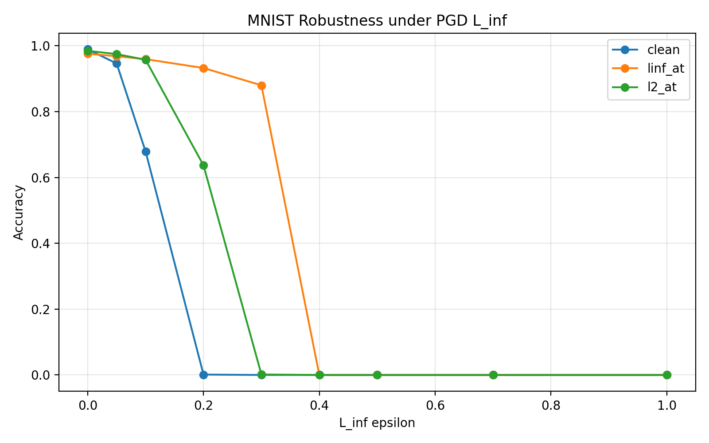
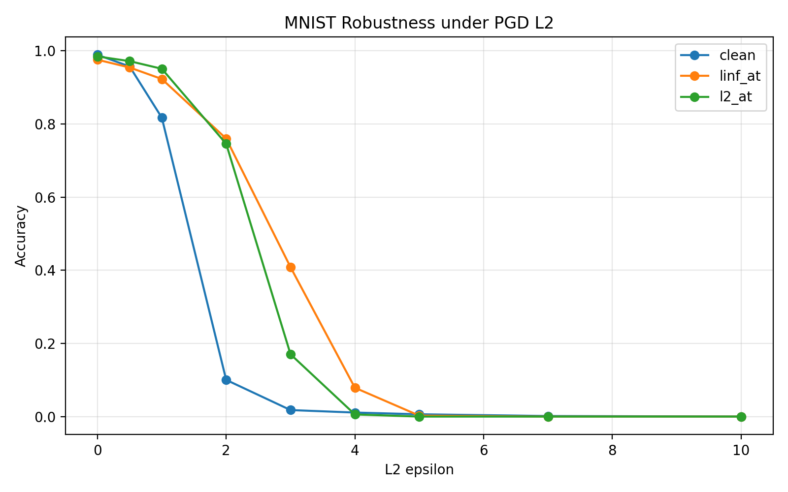
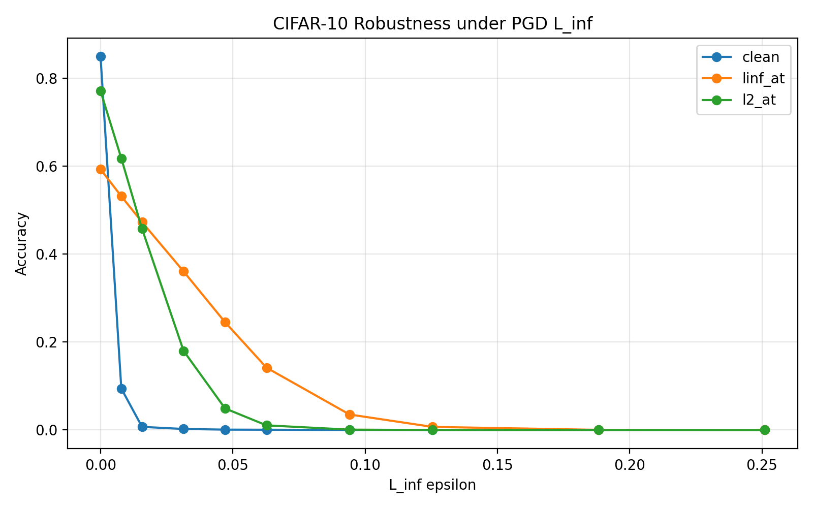
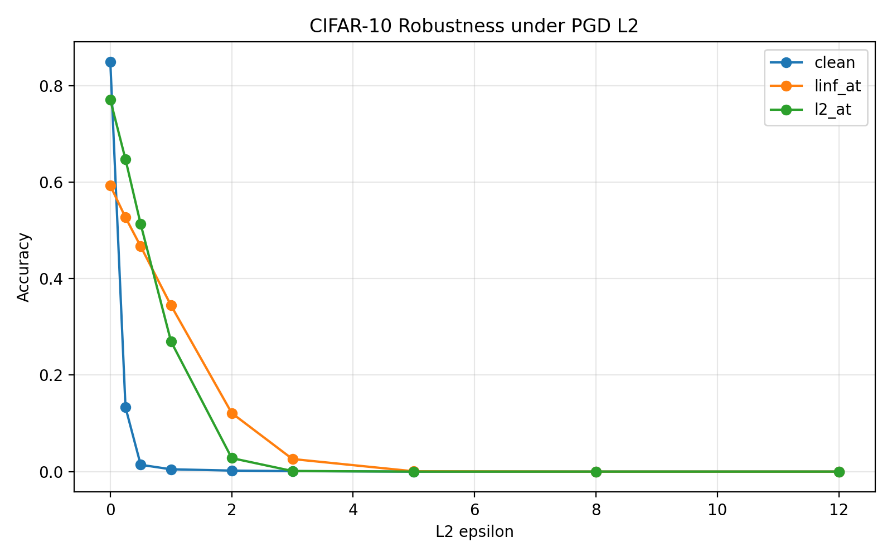

<div align="center">

# Cross-Norm Adversarial Robustness

### PGD adversarial training under \(L_\infty\) and \(L_2\) threat models on MNIST and CIFAR-10

[](https://www.python.org/)
[](https://pytorch.org/)
[](#datasets)
[](LICENSE)

[](https://colab.research.google.com/github/mahdi0x06/cross-norm-adversarial-robustness/blob/main/notebooks/cross_norm_robustness.ipynb)

</div>

---

## Overview

Adversarial training is usually designed around a specific **threat model**. A model trained against \(L_\infty\)-bounded perturbations may be robust to \(L_\infty\) attacks, but that does not automatically imply robustness to \(L_2\) attacks — and vice versa.

This project studies that question directly:

> **How well does adversarial robustness transfer across different perturbation norms?**

For both **MNIST** and **CIFAR-10**, three models are trained:

- **Clean** — standard training
- **\(L_\infty\)-AT** — PGD adversarial training with an \(L_\infty\) constraint
- **\(L_2\)-AT** — PGD adversarial training with an \(L_2\) constraint

Each model is then evaluated under both **PGD-\(L_\infty\)** and **PGD-\(L_2\)** attacks, followed by epsilon sweeps from mild to extreme attack budgets.

---

## Experimental Design

The core adversarial-training objective is

\[
\min_\theta \;
\mathbb{E}_{(x,y)}
\left[
\max_{\|\delta\|_p \le \epsilon}
\mathcal{L}(f_\theta(x+\delta), y)
\right].
\]

The experiment forms the following cross-norm evaluation matrix:

| Training regime | Clean | PGD-\(L_\infty\) | PGD-\(L_2\) |
|---|:---:|:---:|:---:|
| Clean | ✓ | ✓ | ✓ |
| \(L_\infty\)-AT | ✓ | ✓ | ✓ |
| \(L_2\)-AT | ✓ | ✓ | ✓ |

This makes it possible to compare **matched-norm robustness** with **cross-norm transfer**.

---

## Datasets

### MNIST

- 60,000 training images
- 10,000 test images
- Grayscale, \(28 \times 28\)
- Pixel values kept in \([0,1]\)

### CIFAR-10

- 50,000 training images
- 10,000 test images
- RGB, \(32 \times 32\)
- Training augmentation:
  - random crop with padding
  - random horizontal flip
- Pixel values kept in \([0,1]\)

---

## Models

### MNIST CNN

```text
Conv(1 → 32)
ReLU
Conv(32 → 64)
ReLU
MaxPool
Flatten
Linear(12544 → 128)
ReLU
Linear(128 → 10)
```

### CIFAR-10 CNN

```text
Conv(3 → 64)   → ReLU
Conv(64 → 64)  → ReLU
MaxPool

Conv(64 → 128)  → ReLU
Conv(128 → 128) → ReLU
MaxPool

Conv(128 → 256) → ReLU
Conv(256 → 256) → ReLU
MaxPool

Flatten
Linear(4096 → 512)
ReLU
Linear(512 → 10)
```

For each dataset, the clean, \(L_\infty\)-AT, and \(L_2\)-AT models start from the **same initial weights** to reduce initialization as a confounding factor.

---

## Training Configuration

| Dataset | Batch Size | Epochs | Optimizer | Learning Rate |
|---|---:|---:|---|---:|
| MNIST | 128 | 10 | Adam | \(10^{-3}\) |
| CIFAR-10 | 128 | 30 | Adam | \(10^{-3}\) |

Loss function: **Cross-Entropy Loss**

Random seed: **42**

### PGD used during adversarial training

| Dataset | Norm | \(\epsilon\) | \(\alpha\) | Steps |
|---|---|---:|---:|---:|
| MNIST | \(L_\infty\) | 0.30 | 0.01 | 40 |
| MNIST | \(L_2\) | 2.0 | 0.10 | 40 |
| CIFAR-10 | \(L_\infty\) | \(8/255\) | \(2/255\) | 10 |
| CIFAR-10 | \(L_2\) | 0.50 | 0.05 | 10 |

The \(L_\infty\) and \(L_2\) epsilon values are **not directly comparable numerically** because the two norms constrain perturbations in different geometries.

---

# Results

## MNIST — Cross-Norm Robustness

Accuracy at the configured evaluation budgets:

- PGD-\(L_\infty\): \(\epsilon = 0.30\)
- PGD-\(L_2\): \(\epsilon = 2.0\)

| Model | Clean Accuracy | PGD-\(L_\infty\) | PGD-\(L_2\) |
|---|---:|---:|---:|
| Clean | **98.93%** | 0.00% | 14.26% |
| \(L_\infty\)-AT | 97.59% | **89.26%** | **82.55%** |
| \(L_2\)-AT | 98.49% | 0.91% | 78.93% |

### What stands out

- The clean model collapses almost completely under \(L_\infty\) PGD.
- \(L_\infty\)-adversarial training provides very strong matched-norm robustness.
- On MNIST, \(L_\infty\)-AT also transfers surprisingly well to \(L_2\).
- \(L_2\)-AT is strong against \(L_2\), but transfers poorly to the configured \(L_\infty\) attack.

### MNIST robustness curves

<p align="center">
  
  
</p>

---

## CIFAR-10 — Cross-Norm Robustness

Accuracy at the configured evaluation budgets:

- PGD-\(L_\infty\): \(\epsilon = 8/255\)
- PGD-\(L_2\): \(\epsilon = 0.50\)

| Model | Clean Accuracy | PGD-\(L_\infty\) | PGD-\(L_2\) |
|---|---:|---:|---:|
| Clean | **84.90%** | 0.13% | 1.84% |
| \(L_\infty\)-AT | 59.27% | **36.08%** | 47.20% |
| \(L_2\)-AT | 77.06% | 18.12% | **52.47%** |

### What stands out

- Standard training achieves the best clean accuracy but almost no adversarial robustness.
- \(L_\infty\)-AT gives the strongest protection against \(L_\infty\) PGD.
- \(L_2\)-AT gives the strongest protection against \(L_2\) PGD.
- Both robust models show some cross-norm transfer, but matched-norm training remains stronger on CIFAR-10.
- \(L_\infty\)-AT incurs a substantially larger clean-accuracy cost than \(L_2\)-AT in this setup.

### CIFAR-10 robustness curves

<p align="center">
  
  
</p>

---

## Key Findings

> **Robustness is strongly threat-model dependent, and cross-norm transfer is asymmetric and dataset dependent.**

1. **Clean accuracy is not robustness.**  
   The clean baselines reach 98.93% on MNIST and 84.90% on CIFAR-10, yet both collapse under sufficiently strong PGD attacks.

2. **Matched-norm adversarial training works.**  
   \(L_\infty\)-AT is strongest against \(L_\infty\), while \(L_2\)-AT is strongest against \(L_2\) on CIFAR-10.

3. **Cross-norm robustness is not guaranteed.**  
   Training against one perturbation geometry does not consistently protect against another.

4. **Transfer behavior differs across datasets.**  
   MNIST shows strong \(L_\infty \rightarrow L_2\) transfer, whereas CIFAR-10 exhibits a clearer advantage for norm-matched training.

5. **Robustness comes with a clean-accuracy trade-off.**  
   This trade-off is especially visible for CIFAR-10 \(L_\infty\)-AT.

6. **Extreme epsilon sweeps expose the full robustness profile.**  
   A single evaluation budget can hide how quickly a model degrades as attack strength increases.

---

## Epsilon Sweeps

The repository contains full CSV results for increasing attack budgets.

### MNIST

**PGD-\(L_\infty\)**

```text
0.00 → 0.05 → 0.10 → 0.20 → 0.30 → 0.40 → 0.50 → 0.70 → 1.00
```

**PGD-\(L_2\)**

```text
0.0 → 0.5 → 1.0 → 2.0 → 3.0 → 4.0 → 5.0 → 7.0 → 10.0
```

### CIFAR-10

**PGD-\(L_\infty\)**

```text
0 → 2/255 → 4/255 → 8/255 → 12/255 → 16/255 → 24/255 → 32/255 → 48/255 → 64/255
```

**PGD-\(L_2\)**

```text
0.0 → 0.25 → 0.50 → 1.0 → 2.0 → 3.0 → 5.0 → 8.0 → 12.0
```

These sweeps are intended to show the complete **robustness degradation curve**, from mild perturbations to deliberately extreme budgets.

---

## Repository Structure

```text
cross-norm-adversarial-robustness/
│
├── notebooks/
│   └── cross_norm_robustness.ipynb
│
├── figures/
│   ├── mnist_pgd_linf_robustness_curve.png
│   ├── mnist_pgd_l2_robustness_curve.png
│   ├── cifar10_pgd_linf_robustness_curve.png
│   └── cifar10_pgd_l2_robustness_curve.png
│
├── results/
│   ├── mnist_cross_norm_results.csv
│   ├── mnist_pgd_linf_epsilon_sweep.csv
│   ├── mnist_pgd_l2_epsilon_sweep.csv
│   ├── cifar10_cross_norm_results.csv
│   ├── cifar10_pgd_linf_epsilon_sweep.csv
│   └── cifar10_pgd_l2_epsilon_sweep.csv
│
├── .gitignore
├── LICENSE
└── README.md
```

---

## Running the Experiment

### Clone the repository

```bash
git clone https://github.com/mahdi0x06/cross-norm-adversarial-robustness.git
cd cross-norm-adversarial-robustness
```

### Install dependencies

```bash
python -m pip install -r requirements.txt
```

### Launch the notebook

```bash
jupyter notebook notebooks/cross_norm_robustness.ipynb
```

A CUDA-enabled GPU is strongly recommended for the adversarial-training and epsilon-sweep stages.

You can also run the notebook directly in Google Colab:

[](https://colab.research.google.com/github/mahdi0x06/cross-norm-adversarial-robustness/blob/main/notebooks/cross_norm_robustness.ipynb)

---

## Implementation Notes

- PGD-\(L_\infty\) uses signed gradient steps and projection back into the \(L_\infty\) ball.
- PGD-\(L_2\) normalizes the input gradient by its \(L_2\) norm and projects perturbations back into the \(L_2\) ball.
- Random starts are used when generating PGD adversarial examples.
- All adversarial images are clamped to the valid pixel range \([0,1]\).
- Evaluation and training attack configurations are kept separate.
- Epsilon sweeps use attack budgets well beyond the training epsilon to study failure behavior.

---

## Limitations

This repository is an experimental study rather than a complete adversarial-robustness benchmark.

- Only PGD attacks are evaluated.
- The models are compact CNNs rather than large modern architectures.
- \(L_\infty\) and \(L_2\) budgets are not perceptually equivalent.
- Results are limited to MNIST and CIFAR-10.
- Stronger evaluation suites such as multi-attack robustness benchmarks are outside the current scope.

These limitations make the project a useful baseline for future extensions such as additional norms, AutoAttack, stronger architectures, or multi-norm adversarial training.

---

## License

This project is released under the [MIT License](LICENSE).

---

<div align="center">

### Built to study how adversarial robustness transfers across threat models.

</div>